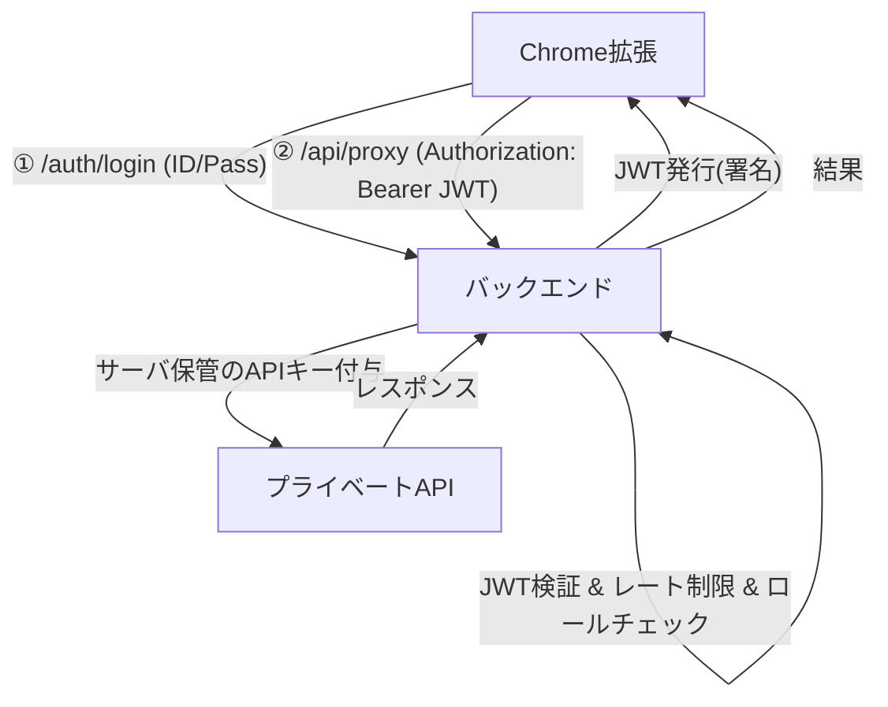

了解です。\*\*「拡張 → 自前バックエンド →（サーバ側でJWT検証＆プライベートAPIへ代理）」\*\*の構成で、**JWT** を使った最小サンプルを示します。
ポイントは **秘密鍵(APIキー等)はサーバにのみ置き、拡張はJWTで自分が正規ユーザーであることだけ証明** することです。

---

# 全体像



---

# サーバ（Node.js + Express + JWT）

**機能**

* `/auth/login`: 認証して **JWT発行**（署名付き）。
* `authMiddleware`: `Authorization: Bearer <JWT>` を検証。
* `/api/proxy`: 認証済みユーザーだけ受け、**サーバ側のAPIキー**でプライベートAPIに代理アクセス。

> 例では Bearer JWT を使います（実装が分かりやすい）。より安全にしたい場合は **HttpOnly+Secureクッキー** でJWTを配布する方式も可能です（最後に補足）。

## 1) 依存と.env

```bash
npm init -y
npm i express jsonwebtoken cors helmet express-rate-limit node-fetch@3 dotenv
npm i -D typescript ts-node @types/express @types/jsonwebtoken @types/node
npx tsc --init
```

`.env`（サーバだけ保持）

```env
PORT=3001
JWT_SECRET=change_me_long_random_string
JWT_EXPIRES_IN=1h

# 代理アクセス先（プライベートAPI）
PRIVATE_API_BASE=https://api.example.internal/v1
PRIVATE_API_KEY=sk_live_xxx_only_on_server
# 開発中は * を許すより、明示的に上書きするのが安全
ALLOWED_ORIGINS=chrome-extension://*,http://localhost:3000
```

## 2) `src/server.ts`

```ts
import 'dotenv/config';
import express from 'express';
import cors from 'cors';
import helmet from 'helmet';
import rateLimit from 'express-rate-limit';
import jwt from 'jsonwebtoken';
import fetch from 'node-fetch';

const app = express();
app.use(express.json());
app.use(helmet({ contentSecurityPolicy: false })); // 逆プロキシやCSPは本番で適切に

// CORS: 拡張のオリジン( chrome-extension://<id> ) を許可
const allowedOrigins = (process.env.ALLOWED_ORIGINS || '')
  .split(',')
  .map(s => s.trim())
  .filter(Boolean);

app.use(cors({
  origin: (origin, cb) => {
    if (!origin) return cb(null, true); // curl等
    if (allowedOrigins.some(allow => allow === '*' || origin.startsWith(allow))) {
      return cb(null, true);
    }
    cb(new Error(`CORS blocked: ${origin}`));
  },
  credentials: true,
}));

// ざっくりレート制限（本番はルートごと/ユーザーごとに調整）
const limiter = rateLimit({ windowMs: 60_000, max: 120 });
app.use(limiter);

const JWT_SECRET = process.env.JWT_SECRET!;
const JWT_EXPIRES_IN = process.env.JWT_EXPIRES_IN || '1h';
const PRIVATE_API_BASE = process.env.PRIVATE_API_BASE!;
const PRIVATE_API_KEY = process.env.PRIVATE_API_KEY!;

// --- ダミー認証: 実際はDBやIdP(OAuth/OIDC)で確認 ---
app.post('/auth/login', async (req, res) => {
  const { username, password } = req.body ?? {};
  // 例: ユーザー: demo / パス: pass1234
  if (username === 'demo' && password === 'pass1234') {
    const token = jwt.sign(
      { sub: username, role: 'user' }, // ペイロードは最小限
      JWT_SECRET,
      { algorithm: 'HS256', expiresIn: JWT_EXPIRES_IN }
    );
    return res.json({ token, expiresIn: JWT_EXPIRES_IN });
  }
  return res.status(401).json({ error: 'invalid_credentials' });
});

// --- JWT検証ミドルウェア ---
function authMiddleware(req: any, res: any, next: any) {
  const h = req.headers.authorization || '';
  const m = h.match(/^Bearer\s+(.+)$/i);
  if (!m) return res.status(401).json({ error: 'missing_bearer' });

  try {
    const decoded = jwt.verify(m[1], JWT_SECRET);
    req.user = decoded; // sub/role等
    next();
  } catch (e: any) {
    return res.status(401).json({ error: 'invalid_token', detail: e.message });
  }
}

// --- 代理: /api/proxy GET (例) ---
// クエリ ?path=/resource のように渡して、サーバでPRIVATE_API_KEYを付与
app.get('/api/proxy', authMiddleware, async (req, res) => {
  const path = String(req.query.path || '');
  if (!path.startsWith('/')) {
    return res.status(400).json({ error: 'path_must_start_with_slash' });
  }

  // 必要ならユーザー権限 check (req.user.role 等)
  // if (req.user.role !== 'user') return res.status(403).json({ error: 'forbidden' });

  const url = new URL(path, PRIVATE_API_BASE).toString();
  try {
    const resp = await fetch(url, {
      method: 'GET',
      headers: {
        'Authorization': `Bearer ${PRIVATE_API_KEY}`, // サーバ保管のキー
        'Accept': 'application/json',
      },
    });

    // 必要に応じてレスポンス整形/マスキング
    const text = await resp.text();
    res.status(resp.status).set('Content-Type', resp.headers.get('content-type') || 'application/json').send(text);
  } catch (e: any) {
    res.status(502).json({ error: 'upstream_error', detail: e.message });
  }
});

// POST/PUT/PATCH/DELETE の代理も同様に実装可能
// app.post('/api/proxy', authMiddleware, ...)

const port = Number(process.env.PORT || 3001);
app.listen(port, () => {
  console.log(`Server listening on http://localhost:${port}`);
});
```

---

# Chrome拡張（Manifest V3）

**流れ**

* `options.html`でログインフォーム → サーバ `/auth/login` → **JWTを`chrome.storage.session`へ保存**
* Service Worker（`background.js`）で **保存JWTを付与して** `/api/proxy` を叩く
* `content_script` や `popup` から `chrome.runtime.sendMessage` でSWに依頼する形が扱いやすい

> 本番では余計な権限は外してください。

## 1) `manifest.json`

```json
{
  "manifest_version": 3,
  "name": "JWT Proxy Example",
  "version": "0.1.0",
  "description": "Backend-proxy via JWT",
  "permissions": ["storage", "scripting"],
  "host_permissions": [
    "http://localhost:3001/*"
  ],
  "background": {
    "service_worker": "background.js"
  },
  "options_page": "options.html",
  "action": {
    "default_title": "JWT Proxy"
  }
}
```

## 2) `background.js`（Service Worker）

```js
// JWTの取得/保存は session に（ブラウザ再起動で消える）
// 必要に応じて chrome.storage.local へ（ただし漏洩リスクは上がる）

async function getToken() {
  const { token } = await chrome.storage.session.get(['token']);
  return token || null;
}

async function setToken(token) {
  await chrome.storage.session.set({ token });
}

chrome.runtime.onMessage.addListener((msg, sender, sendResponse) => {
  (async () => {
    try {
      if (msg.type === 'LOGIN') {
        const resp = await fetch('http://localhost:3001/auth/login', {
          method: 'POST',
          headers: { 'Content-Type': 'application/json' },
          body: JSON.stringify({ username: msg.username, password: msg.password })
        });
        if (!resp.ok) {
          const err = await resp.json().catch(() => ({}));
          return sendResponse({ ok: false, error: err.error || 'login_failed' });
        }
        const data = await resp.json();
        await setToken(data.token);
        return sendResponse({ ok: true });
      }

      if (msg.type === 'CALL_PRIVATE') {
        const token = await getToken();
        if (!token) return sendResponse({ ok: false, error: 'not_logged_in' });

        const u = new URL('http://localhost:3001/api/proxy');
        u.searchParams.set('path', msg.path || '/status');

        const resp = await fetch(u.toString(), {
          method: 'GET',
          headers: { 'Authorization': `Bearer ${token}` }
        });

        const text = await resp.text();
        let json = null;
        try { json = JSON.parse(text); } catch {}
        return sendResponse({ ok: resp.ok, status: resp.status, data: json ?? text });
      }

      return sendResponse({ ok: false, error: 'unknown_message' });
    } catch (e) {
      return sendResponse({ ok: false, error: String(e) });
    }
  })();

  // 非同期応答
  return true;
});
```

## 3) `options.html`（簡易ログインUI）

```html
<!doctype html>
<html>
  <body>
    <h2>Login</h2>
    <form id="f">
      <input id="u" placeholder="username" value="demo">
      <input id="p" type="password" placeholder="password" value="pass1234">
      <button>Login</button>
    </form>

    <h2>Call Private API</h2>
    <button id="call">GET /api/proxy?path=/status</button>

    <pre id="out"></pre>

    <script>
      const out = document.getElementById('out');

      document.getElementById('f').addEventListener('submit', async (e) => {
        e.preventDefault();
        const username = document.getElementById('u').value;
        const password = document.getElementById('p').value;
        const resp = await chrome.runtime.sendMessage({ type: 'LOGIN', username, password });
        out.textContent = JSON.stringify(resp, null, 2);
      });

      document.getElementById('call').addEventListener('click', async () => {
        const resp = await chrome.runtime.sendMessage({ type: 'CALL_PRIVATE', path: '/status' });
        out.textContent = JSON.stringify(resp, null, 2);
      });
    </script>
  </body>
</html>
```

---

## 動作確認（サーバ側）

```bash
# 開発起動
npx ts-node src/server.ts
# または ts-node-dev / nodemon など
```

* Chrome拡張を「パッケージ化されていない拡張機能を読み込む」で読み込み
* `options` でログイン → 「Call Private API」実行
* サーバログ・Networkを確認

---

# セキュリティ要点（必読）

1. **秘密はサーバだけに**
   プライベートAPIのキーやクライアントシークレットは**絶対に拡張内に置かない**。

2. **JWTの保管**

   * 上記サンプルは簡便のため **`chrome.storage.session`** に保存。
   * さらに安全にするなら **HttpOnly+Secureクッキー** を採用し、拡張からは `credentials: 'include'` で送る。

     * その場合、CORSで `Access-Control-Allow-Credentials: true` と、`Access-Control-Allow-Origin` に拡張ID（`chrome-extension://<id>`）を明示する必要があります。（`*`不可）

3. **最小権限・レート制限・ロール**

   * `/api/proxy` はユーザーロール・スコープで**必要最小限**に制御。
   * レート制限・監査ログ・不正検知をサーバ側で。

4. **リクエストのバリデーション**

   * `path` ホワイトリスト化（`/v1/allowed/...` のみ許可、など）
   * メソッド・ヘッダ・ボディのスキーマ検証

5. **ローテーション**

   * サーバ側の **`PRIVATE_API_KEY` は定期ローテーション**。
   * JWTの有効期限は短め（例: 15–60分）。必要ならRefreshトークン（HttpOnlyクッキー）を別途導入。

---

# （参考）HttpOnlyクッキー運用の概略

* `/auth/login` で `Set-Cookie: access_token=...; HttpOnly; Secure; SameSite=None`
* 拡張からは `fetch(url, { credentials: 'include' })`
* サーバは `req.cookies.access_token` を検証
* メリット: 拡張スクリプトからトークン文字列に**直接触れられない**（XSS耐性が上がる）
* デメリット: CORS/クッキー属性の調整が必要、拡張IDごとに`Access-Control-Allow-Origin`の扱いに注意

---

必要なら、このサンプルを**HttpOnlyクッキー方式**に書き換えたコード、または **POST/PUT 代理**・**Refreshトークン**・**RBAC（ロールベースアクセス）** まで含めた実運用テンプレも用意します。どこまで広げますか？
